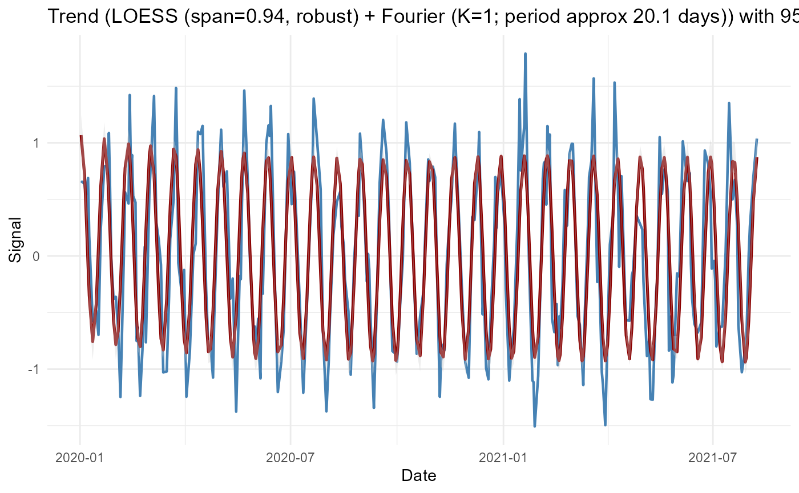
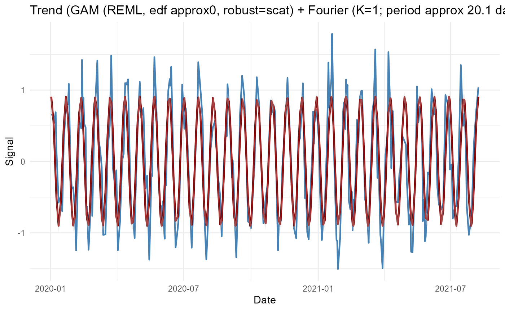
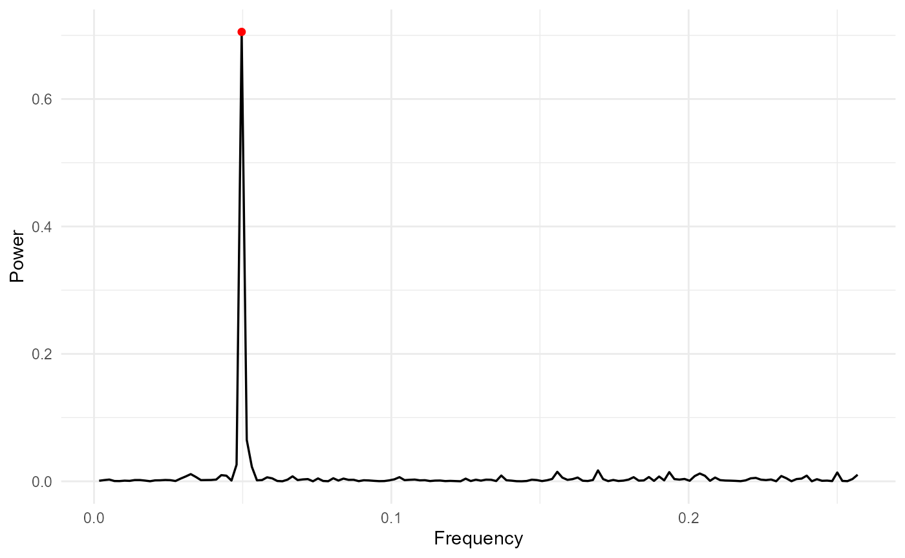

# cycleTrendR Overview

## Introduction

cycleTrendR provides a unified framework for analyzing time‑series that
contain both trend and cyclic components. It supports:

LOESS, GAM, and GAMM trend estimation

Automatic Fourier harmonic selection (AICc/BIC)

Bootstrap confidence intervals (IID or MBB)

Change‑point detection

Lomb–Scargle periodogram for irregular sampling

Rolling‑origin forecasting

Publication‑quality ggplot2 visualizations

This vignette demonstrates the main workflows using simulated data.

## Simulated Example Data

We simulate a noisy cyclic signal with irregular sampling:

``` r
dates <- as.Date("2020-01-01") + cumsum(sample(1:3, 300, replace = TRUE))
signal <- sin(2*pi*as.numeric(dates)/20) + rnorm(300, 0, 0.3)
```

## LOESS Trend + Automatic Fourier Selection

``` r
res_loess <- adaptive_cycle_trend_analysis(
  signal = signal,
  dates = dates,
  trendmethod = "loess",
  usefourier = TRUE,
  auto_fourier_select = TRUE,
  nboot = 50
)
#> Using original scale.
#> Irregular dates detected: Lomb Scargle + LOESS/GAM(M)
#> Auto seasonality: dominant period approx 20.14 samples -> seasonalfrequency=20
#> loess.as proposed span (criterion=aicc) = 0.944
#> Fourier selection: criterion=AICc -> K=1 (from 0..6)
#> Warning in adaptive_cycle_trend_analysis(signal = signal, dates = dates, :
#> Model-based CI not implemented for this configuration; switching to
#> bootstrapiid.
#> Bootstrap CI (bootstrapiid): 50 resamples
#> Warning in tseries::adf.test(signal, alternative = "stationary"): p-value
#> smaller than printed p-value
#> Warning in tseries::kpss.test(signal, null = "Level"): p-value greater than
#> printed p-value

res_loess$Plot$Trend
```



## GAM Trend

``` r
res_gam <- adaptive_cycle_trend_analysis(
  signal = signal,
  dates = dates,
  trendmethod = "gam",
  usefourier = TRUE,
  nboot = 50
)
#> Using original scale.
#> Irregular dates detected: Lomb Scargle + LOESS/GAM(M)
#> Auto seasonality: dominant period approx 20.14 samples -> seasonalfrequency=20
#> Fourier selection: criterion=AICc -> K=1 (from 0..6)
#> Warning in adaptive_cycle_trend_analysis(signal = signal, dates = dates, :
#> Model-based CI not implemented for this configuration; switching to
#> bootstrapiid.
#> Bootstrap CI (bootstrapiid): 50 resamples
#> Warning in tseries::adf.test(signal, alternative = "stationary"): p-value
#> smaller than printed p-value
#> Warning in tseries::kpss.test(signal, null = "Level"): p-value greater than
#> printed p-value

res_gam$Plot$Trend
```



## GAMM Trend with Random Effects

``` r
group <- rep(letters[1:4], length.out = length(signal))

res_gamm <- adaptive_cycle_trend_analysis(
  signal = signal,
  dates = dates,
  trendmethod = "gam",
  use_gamm = TRUE,
  group_var = "subject",
  group_values = group,
  usefourier = FALSE,
  nboot = 20
)
#> Using original scale.
#> Irregular dates detected: Lomb Scargle + LOESS/GAM(M)
#> Attached grouping column 'subject' from `group_values`.
#> Converted group_var 'subject' to factor (4 levels).
#> Auto seasonality: dominant period approx 20.14 samples -> seasonalfrequency=20
#> Warning in adaptive_cycle_trend_analysis(signal = signal, dates = dates, :
#> Model-based CI not implemented for this configuration; switching to
#> bootstrapiid.
#> Bootstrap CI (bootstrapiid): 20 resamples
#> Warning in tseries::adf.test(signal, alternative = "stationary"): p-value
#> smaller than printed p-value
#> Warning in tseries::kpss.test(signal, null = "Level"): p-value greater than
#> printed p-value

res_gamm$Plot$Trend
```


## Irregular Sampling + Fourier + Lomb–Scargle

Irregular sampling is detected automatically and the Lomb–Scargle
periodogram is used:

``` r
  res_irreg <- adaptive_cycle_trend_analysis(
  signal = signal,
  dates = dates,
  trendmethod = "loess",
  usefourier = TRUE,
  auto_fourier_select = TRUE,
  nboot = 50
)
#> Using original scale.
#> Irregular dates detected: Lomb Scargle + LOESS/GAM(M)
#> Auto seasonality: dominant period approx 20.14 samples -> seasonalfrequency=20
#> loess.as proposed span (criterion=aicc) = 0.944
#> Fourier selection: criterion=AICc -> K=1 (from 0..6)
#> Warning in adaptive_cycle_trend_analysis(signal = signal, dates = dates, :
#> Model-based CI not implemented for this configuration; switching to
#> bootstrapiid.
#> Bootstrap CI (bootstrapiid): 50 resamples
#> Warning in tseries::adf.test(signal, alternative = "stationary"): p-value
#> smaller than printed p-value
#> Warning in tseries::kpss.test(signal, null = "Level"): p-value greater than
#> printed p-value

res_irreg$Plot$Spectrum
```



## Change‑Point Detection

``` r
res_loess$ChangePoints
#> Date of length 0
```

## Bootstrap Confidence Intervals

``` r
head(res_loess$CI$lower)
#> [1]  0.9356674  0.5615359  0.3088493 -0.2316584 -0.5025484 -0.9191605
head(res_loess$CI$upper)
#> [1]  1.24514207  0.89025520  0.63385775  0.04906948 -0.22326844 -0.64021793
```

## Conclusion

cycleTrendR provides a flexible and robust toolkit for analyzing complex
time‑series with trend and cyclic components, especially when sampling
is irregular or noise levels are high. It is suitable for biomedical
assay monitoring, environmental signals, and forecasting tasks.
